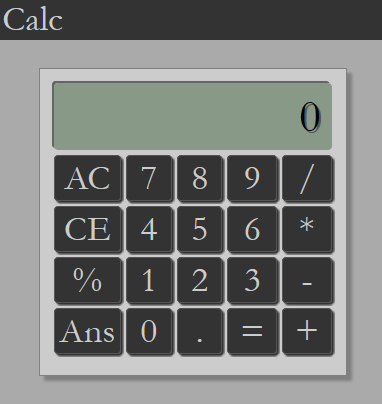
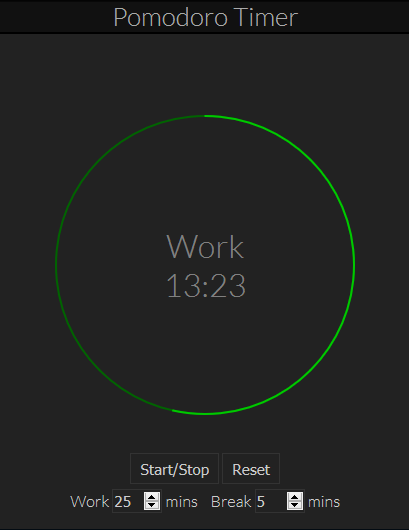
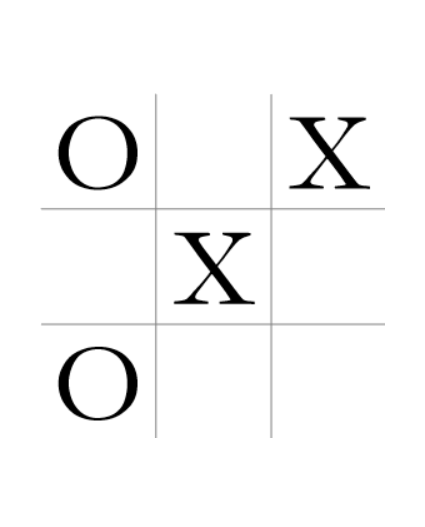
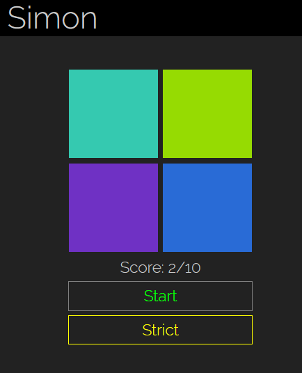
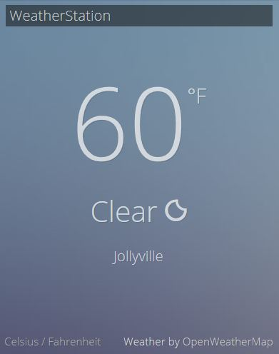
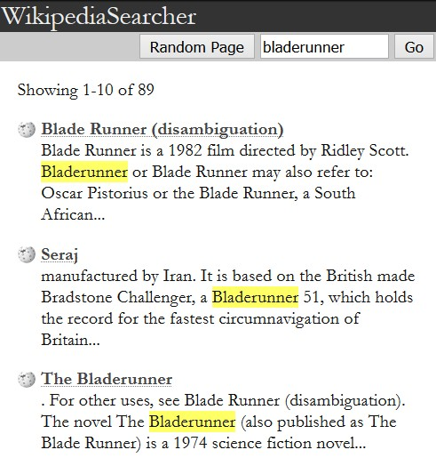
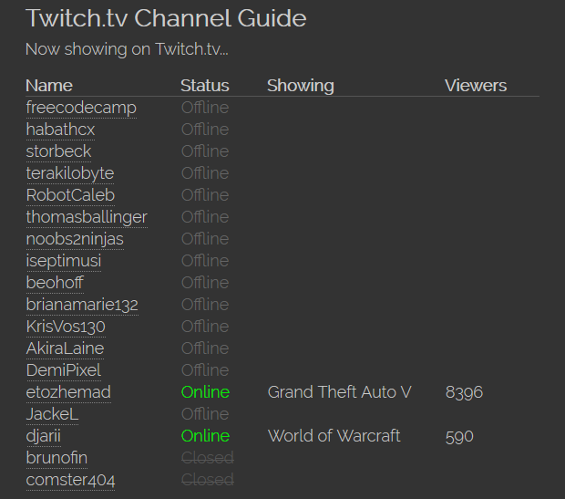
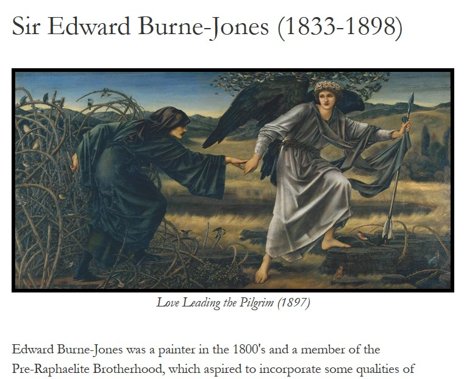

# WebApplications

These are some Single Page Web Applications developed for the [Front End Development Certification from FreeCodeCamp](https://www.freecodecamp.com/bburns), March - May 2016.

## Advanced

* [Calculator](https://github.com/bburns/Calculator)

* [Pomodoro Timer](https://github.com/bburns/PomodoroTimer)

* [Tic-Tac-Toe](http://bburns.github.io/Tic-Tac-Toe/)

* [Simon Game](http://bburns.github.io/SimonGame/)

## Intermediate

* [Weather Station](http://bburns.github.io/WeatherStation/)

* [Wikipedia Searcher](http://codepen.io/bburns/full/ONzeox/) [(source)](http://codepen.io/bburns/pen/ONzeox/)

* [TwitchTv Guide](http://codepen.io/bburns/full/eZbZNE/) [(source)](http://codepen.io/bburns/pen/eZbZNE/)

## Simple

* [Artist Tribute Page](http://codepen.io/bburns/full/mPqoER/) [(source)](http://codepen.io/bburns/pen/mPqoER/)

* [Random Quote Machine](http://codepen.io/bburns/full/eZyEwv/) [(source)](http://codepen.io/bburns/pen/eZyEwv/)

<!-- * [Personal Portfolio](http://codepen.io/bburns/full/EKbzgL/) [(source)](http://codepen.io/bburns/pen/EKbzgL/) -->

<!--  -->

## License

MIT

